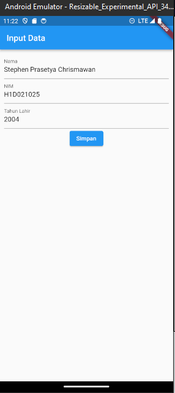
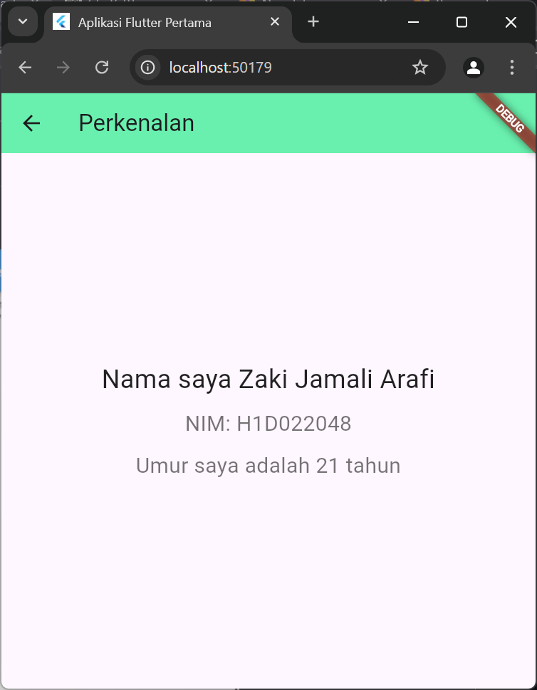

# Tugas Pertemuan 2

Nama : Zaki Jamali Arafi

NIM : H1D022048

Shift Baru: D

# Penjelasan Proses Passing Data dari Form ke Tampilan

1. Pengumpulan Data di FormData
    - Di dalam class `FormDataState`, memiliki tiga `TextEditingController`: `_namaController`, `_nimController`, dan `_tahunController`.
    - Controller-controller ini terhubung dengan masing-masing `TextFormField` di form.

2. Validasi Input
    - Sebelum melakukan passing data, melakukan validasi input menggunakan `_formKey.currentState!.validate()`.
    - Jika validasi berhasil, lanjut ke proses passing data.

3. Persiapan Data
    - Setelah validasi berhasil, mengambil nilai dari setiap controller:
      String nama = _namaController.text;
      String nim = _nimController.text;
      int tahun = int.parse(_tahunController.text);
      

4. Passing Data melalui Constructor
    - Menggunakan `Navigator.of(context).push()` untuk berpindah ke halaman `TampilData`.
    - Saat membuat instance `TampilData`, meneruskan data sebagai parameter constructor:
      Navigator.of(context).push(MaterialPageRoute(
        builder: (context) => TampilData(nama: nama, nim: nim, tahun: tahun)
      ));

5. Penerimaan Data di TampilData
    - Class `TampilData` memiliki constructor yang menerima parameter `nama`, `nim`, dan `tahun`:
      const TampilData({
        Key? key,
        required this.nama,
        required this.nim,
        required this.tahun,
      }) : super(key: key);
    - Data yang diterima kemudian disimpan sebagai properti class.

6. Penggunaan Data di TampilData
    - Di dalam method `build()` dari `TampilData`, menggunakan data yang telah diterima untuk menampilkan informasi:
      Text("Nama: $nama"),
      Text("NIM: $nim"),
      Text("Umur: $umur tahun"),

Dengan cara ini, data yang diinput oleh pengguna di `FormData` berhasil diteruskan dan ditampilkan di `TampilData`. Proses ini memungkinkan untuk memisahkan logika input dan tampilan hasil, sambil tetap mempertahankan alur data yang jelas dan efisien.
## Screenshot
Contoh :

